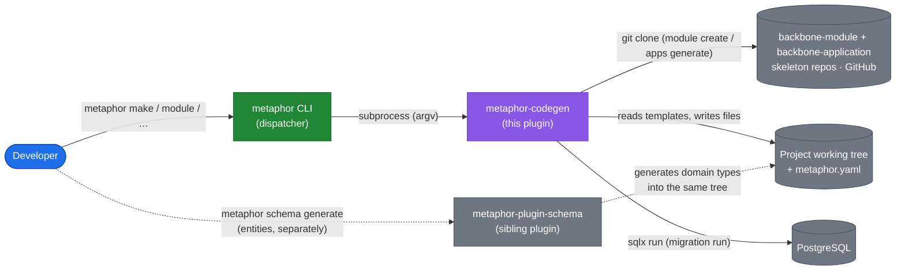
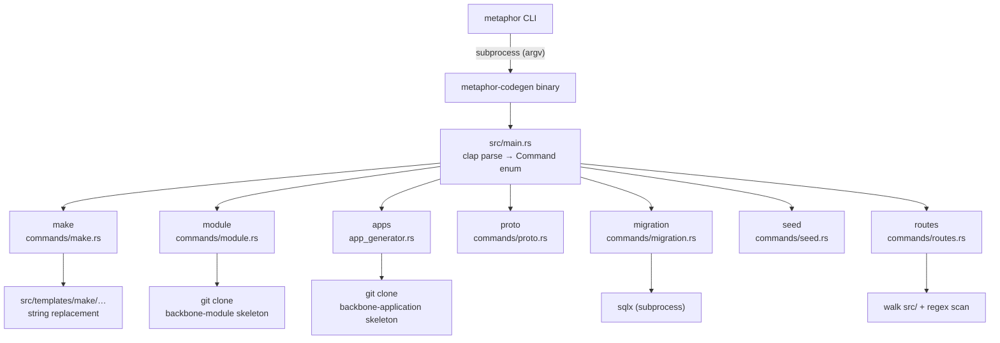
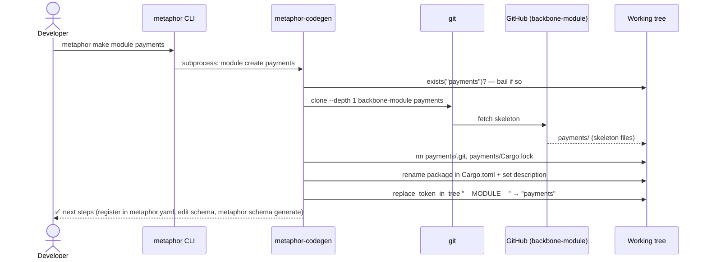

# Maintainer Guide

> **Reader:** Maintainer. **Mode:** Explanation + How-to.
> How the plugin itself works (not the code it generates — that's [architecture.md](architecture.md))
> and how to extend it without breaking conventions. Assumes you can read Rust and have the repo
> building.

## System context (C4 level 1)

Before the internals, the outside view: who and what `metaphor-codegen` talks to.



*Caption — what to notice:* the plugin never talks to the developer directly (the CLI does), and it
does **not** generate entities — that's the sibling `metaphor-plugin-schema`, which writes into the
*same* working tree. The two external dependencies that can fail are the **GitHub skeleton repos**
(`module create` and `apps generate` need network + git) and **PostgreSQL** (`migration run` needs a
reachable DB).

## The shape of the plugin (C4 level 2–3)

`metaphor-codegen` is a thin clap dispatcher over seven command modules. The whole control flow
fits in one diagram:



*Caption — what to notice:* `main.rs` does only two things — parse args and dispatch to a
`commands::<group>::handle_command(...)`. All real work lives in `src/commands/*.rs`. There is no
shared "engine"; each command group is self-contained, and each reaches for a *different*
generation mechanism (local templates for `make`, skeleton clone for `module` / `apps`, or none).

### Key files

| File | Role |
|------|------|
| `src/main.rs` | The clap command tree + `main()` dispatch. **The authoritative CLI surface.** |
| `src/lib.rs` | Re-exports `commands`, `app_generator`, `templates`, `utils` so the binary (and tests) can call in. |
| `src/commands/mod.rs` | Declares the seven command modules. |
| `src/commands/<group>.rs` | An `Action` enum + `handle_command(&action)` per group. |
| `src/templates/template_processor.rs` | `{{PLACEHOLDER}}` string-replacement engine for `make`. |
| `src/templates/<kind>/…` | On-disk template files consumed by `make` (the `app/` tree is now dead). |
| `src/app_generator.rs` | Application scaffolding logic for `apps` — clones the `backbone-application` skeleton and stamps names. |

### The CLI ↔ handler split (important)

Some groups define their clap types **twice**: a `CliModuleAction` / `CliMigrationAction` in
`main.rs` (the user-facing flags) and a `ModuleAction` / `MigrationAction` in the handler module
(the internal contract), bridged by a `From<&Cli…>` impl. This keeps the handler independent of
clap so it can be unit-tested and reused. `make`, `apps`, `proto`, `seed`, and `routes` skip the
indirection and let clap derive directly on the handler's own `Action` type. When you touch a
command's flags, check whether it has the two-type split — if so, you must edit **both** the CLI
enum and the handler enum and keep the `From` impl exhaustive (the compiler enforces this).

## How templating actually works

There are now **two** generation mechanisms: local string-replacement (only `make`) and
skeleton-clone (`module create` **and** `apps generate`). The old Handlebars path for `apps` is gone.
Know which one you're touching.

### 1. String-replacement (the `make` targets)

`templates/template_processor.rs` reads a template file, replaces `{{PLACEHOLDER}}` tokens from a
`HashMap` built off a `TemplateContext`, and writes the result. Placeholders also appear in
*filenames* (e.g. `create_{{entity_name_snake}}.rs`) and are replaced during the directory walk.
Supported tokens include `{{MODULE_NAME}}`, `{{MODULE_NAME_PASCAL/SNAKE/UPPER/LOWER}}`,
`{{ENTITY_NAME}}`, `{{PascalCaseEntity}}`, `{{ENTITY_NAME_SNAKE}}`, `{{ENTITY_NAME_PLURAL}}`,
`{{AUTHOR}}`, `{{DESCRIPTION}}`, `{{CURRENT_TIMESTAMP}}`, plus lowercase CRUD variants. Case
conversion (`to_pascal_case_string`, `to_snake_case_string`, `to_plural_string`) is naive but
covers the common English cases — see the unit tests at the bottom of `template_processor.rs`.

> **Gotcha:** the processor intentionally does **not** replace bare `metaphor`/`Metaphor` anymore
> (it used to, and it clobbered dependency names like `metaphor-core`). Always use explicit
> `{{…}}` placeholders in templates.

### 2. Skeleton-clone (`module create` **and** `apps generate`) — the current reality

**Neither `module create` nor `apps generate` uses local templates anymore.** Both clone a canonical
skeleton repo and stamp names in via the same `replace_token_in_tree` helper. `module create`:

1. `git clone --depth 1 https://github.com/faridlab/backbone-module <name>` — the canonical module
   skeleton is a *separate repo*, the single source of truth for module structure.
2. Removes `.git` and `Cargo.lock` (detach from the skeleton; resolve deps fresh).
3. Renames the package in `Cargo.toml` (`backbone-module-skeleton` → `<name>`) and sets the
   description.
4. Stamps `__MODULE__` → the schema-module name (the Cargo name minus a `backbone-` prefix) across
   every UTF-8 file via `replace_token_in_tree`.
5. Prints next steps: register in `metaphor.yaml`, edit `schema/models/…`, run `metaphor schema
   generate`.

`apps generate` (in `app_generator.rs`) is the same shape:

1. Bails if `apps/<name>/` already exists, then `git clone --depth 1
   https://github.com/faridlab/backbone-application <name>`.
2. Removes `.git` and `Cargo.lock`.
3. Stamps the skeleton's baked-in package name — the constants `SKELETON_NAME_KEBAB` (`backbone-app`)
   and `SKELETON_NAME_SNAKE` (`backbone_app`) — to the requested app name across every UTF-8 file.
4. Prints next steps, including **register the app in `metaphor.yaml`** (it no longer edits any
   workspace `Cargo.toml`).

See [ADR-0002](adr/0002-skeleton-clone-scaffolding.md) for *why*. The consequence for maintainers:
**to change the generated module/app layout, edit the `backbone-module` / `backbone-application` repo,
not this plugin.** This plugin only clones and stamps.

Traced end-to-end, `metaphor make module payments` (or `metaphor-codegen module create payments`):



*Caption:* the two failure points are the `exists()` guard (won't clobber an existing dir) and the
`git clone` (explicit error if the repo is unreachable). Everything after the clone is local
string-stamping — no template engine involved.

### Dead code to be aware of

`template_processor.rs` carries `get_module_template_dir()` / `get_entity_template_dir()` /
`get_crud_template_dir()` / `get_aggregate_template_dir()`, all pointing at a legacy
`crates/metaphor-cli/src/templates/…` path that predates this crate's extraction. They are unused
(`#![allow(dead_code)]`). Don't build new features on them — if you need the make-template dir,
resolve it relative to this crate. This is cleanup debt, flagged here so you don't mistake it for
live wiring.

The `src/templates/app/` tree is likewise dead as of v0.2.0: `apps generate` clones the
`backbone-application` skeleton instead of expanding it. Same story as `src/templates/module/` after
v0.1.8 — outstanding cleanup, not live wiring.

## Walkthrough: add a new `make` target

Say you want `metaphor-codegen make projection <Name> --module <m>` to scaffold a read-model
projection. The pattern for any new `make` target:

1. **Add the template.** Create `src/templates/make/projection/{{ENTITY_NAME_SNAKE}}_projection.rs`
   using only `{{…}}` placeholders. Include a `// <<< CUSTOM` region for the hand-written body so
   regeneration stays safe.
2. **Add the enum variant.** In `src/commands/make.rs`, add a `Projection { name, module, … }`
   variant to `MakeAction` with `#[command(name = "projection")]` and `#[arg(short, long)]`
   flags mirroring the existing variants (`Command`, `Query` are the closest models).
3. **Handle it.** In the same file's `handle_command` match, add a `MakeAction::Projection { … }`
   arm that builds a `TemplateContext` (`TemplateContext::new_for_entity(...)` if it's entity-
   scoped) and calls `process_template_file` for each template file to its destination under
   `src/<layer>/…` in the target module.
4. **Follow the layer rule.** Put the output in the correct Clean-Architecture layer — a projection
   is a read model, so `src/infrastructure/projections/` or `src/application/queries/` per the
   conventions in [architecture.md](architecture.md). Never invent a new top-level layer.
5. **Print consistent status.** Match the existing `✅`/`📁` colored output so the tool speaks with
   one voice.
6. **Test the case conversion**, not the filesystem: add a `#[test]` alongside the ones in
   `template_processor.rs` if you introduced new placeholder logic.
7. **Document it.** Add a row/section to `docs/commands-make.md` and, if it's a new concept, a
   [glossary](glossary.md) entry. Docs are part of "done."

Rebuild and try it:

```bash
cargo build
target/debug/metaphor-codegen make projection UserActivity --module analytics
```

## Regeneration safety — the `// <<< CUSTOM` contract

Generated files interleave generator-owned and developer-owned code. The convention:

```rust
// <<< CUSTOM: business logic — the generator will not touch anything between these markers
pub fn is_eligible(&self) -> bool { /* your code */ }
// >>> CUSTOM
```

Any generator you add **must** preserve `// <<< CUSTOM … >>> CUSTOM` regions on re-run. A generator
that overwrites custom regions is a regression, no matter how correct its output. When in doubt,
generate *additively* (new files) rather than rewriting existing ones.

## Versioning & release

- Pinned direct dependency versions (no workspace inheritance) — this crate is independently
  releasable.
- Bump `version` in `Cargo.toml`, then tag `vX.Y.Z` and push the tag. `.github/workflows/release.yml`
  cross-builds Linux + macOS × x86_64 + aarch64 and uploads binaries to the GitHub Release.
- The `metaphor` CLI discovers the resulting binary on `PATH`, `$METAPHOR_PLUGIN_BIN_DIR`, or
  `~/.metaphor/bin/`.

## Known limitations to keep documented

The `routes` command (`src/commands/routes.rs`) scans a source tree for Axum `.route(...)` calls and
`BackboneCrudHandler::routes(...)` mounts and prints them as table/list/json/markdown — see
[commands-routes.md](commands-routes.md). Two limitations are load-bearing and must stay documented
as you evolve it:

- **Nested routers (`Router::nest`) are not followed** — inner routes report at their literal mount
  path, without the prefix. When you add nesting support, update the limitations section of
  `commands-routes.md`.
- The scan is **static/textual**, not semantic — dynamically-built routes won't appear. If you make
  the CRUD-surface constant (`BACKBONE_CRUD_ENDPOINTS`) track a new upstream shape in
  `backbone-core`, update the table in `commands-routes.md` in the same PR.

---

**See also:** [Generated-code architecture](architecture.md) · [ADRs](index.md#architecture-decision-records)
· [Contribution guide](contributing.md)
